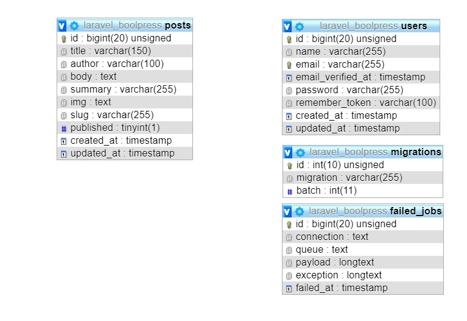
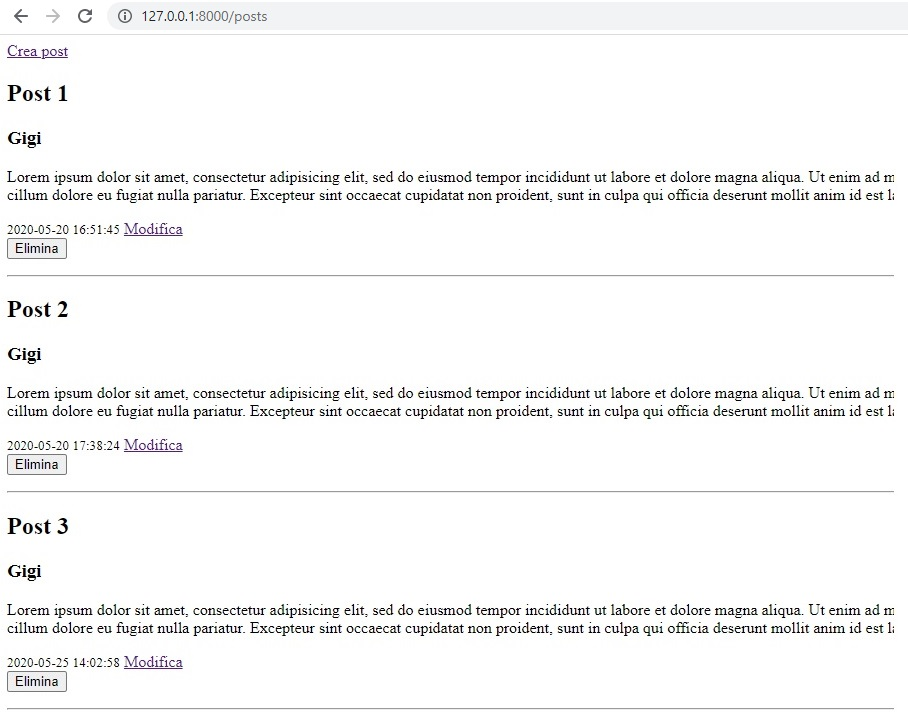
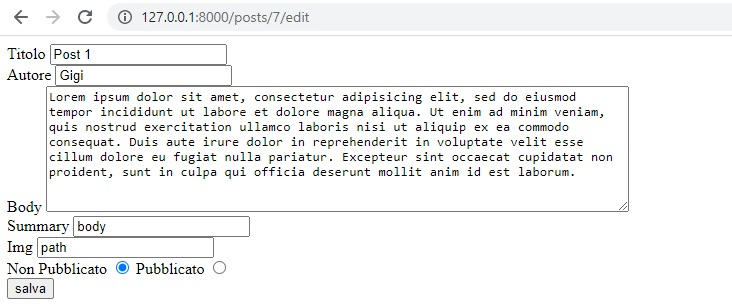
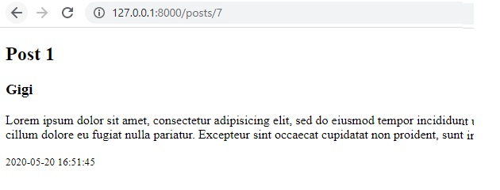

# Laravel-boolpress-base
Practice creating a complete CRUD with validation and error messages using MVC.

HTML, PHP, Laravel, MySQL
***
### DB:

### Preview-index:  

### Preview-edit:  

### Preview-show:  

